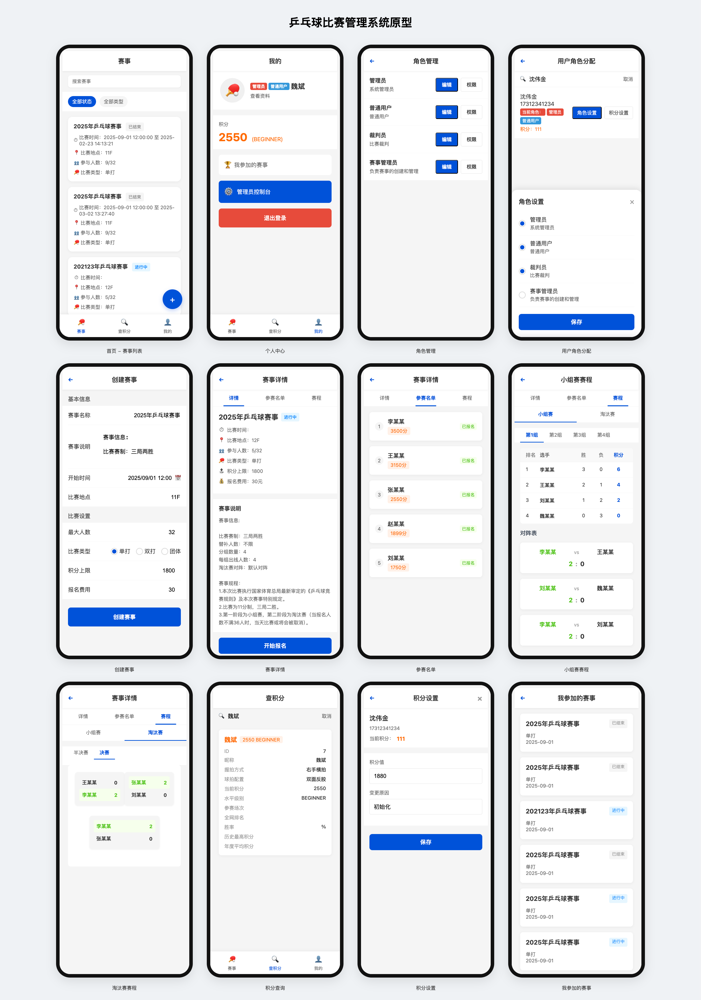

# 体育赛事管理系统

## 项目简介
这是一个基于 Spring Boot + Vue.js 的体育赛事管理系统，支持赛事创建、报名、比赛进程管理、积分管理等功能。

## 技术栈
### 后端
- Spring Boot 2.7.0
- Spring Security + JWT 认证
- MyBatis
- MySQL 8.0
- Maven

### 前端
- Vue 3 + Vant UI（移动端H5框架）
- Vue Router
- Axios
- 一套代码，同时支持H5和小程序

## 项目结构
```
sports/
├── sports-server/        # 后端项目
│   ├── src/
│   │   ├── main/
│   │   │   ├── java/
│   │   │   └── resources/
│   │   └── test/
│   └── pom.xml
│
└── sports-h5/           # 前端项目
    ├── src/
    │   ├── api/
    │   ├── components/
    │   ├── views/
    │   └── router/
    └── package.json
```

## Docker 一键部署（推荐）

### 步骤
1. 配置环境变量：
   - 在项目根目录下新建 `.env` 文件，内容如下：
     ```
     SPRING_DATASOURCE_URL=jdbc:mysql://database:3306/sports_db?useSSL=false&serverTimezone=UTC&allowPublicKeyRetrieval=true
     SPRING_DATASOURCE_USERNAME=root
     SPRING_DATASOURCE_PASSWORD=请修改为安全密码
     JWT_SECRET=请修改为安全JWT密钥
     ```
   - 建议将 `.env` 文件加入 `.gitignore`，避免敏感信息泄露。

2. 一键部署：
   ```bash
   chmod +x deploy.sh stop-services.sh
   ./deploy.sh
   ```
   - 脚本会自动完成前端、后端构建和 Docker 服务启动。
   - 如需停止服务，执行 `./stop-services.sh`

3. 访问服务：
   - 前端：http://localhost
   - 后端API：http://localhost:8088

### 常见问题
- 容器未启动成功，请检查 `.env` 配置和端口占用。
- 数据库数据持久化在 `mysql-data/` 目录，日志在 `logs/` 目录。
- 如需自定义配置，请修改 `my.cnf` 或 `.env` 文件。

## 功能特性


原型图：


## API 文档
API 接口文档使用 Swagger 生成，启动后端服务后访问：
```
http://localhost:8088/swagger-ui.html
```

## 开发环境要求
- JDK 17
- Node.js 16+
- MySQL 8.0+

## 注意事项

### 1. 安全性考虑
- 用户信息保护
- 支付安全
- 数据备份

### 2. 性能优化
- 首屏加载优化
- 请求响应优化
- 数据缓存策略

### 3. 用户体验
- 界面交互设计
- 操作流程优化
- 错误提示友好化

## 传统手动部署方式（不推荐）

> 推荐使用上方的 Docker 一键部署，以下为传统方式，仅供参考。

### 后端启动
1. 创建数据库并导入 SQL 文件
2. 修改 `application.properties` 中的数据库配置
3. 运行 Spring Boot 应用

```bash
cd sports-server
mvn spring-boot:run
```

### 前端启动
```bash
cd sports-h5
npm install
npm run serve
```

### 简单部署方案
```bash
# 前端打包
npm run build
# 将dist目录放到nginx的html目录

# 后端打包
mvn package
# 运行jar包
java -jar sports-server.jar
```

### nginx配置示例
```nginx
server {
    listen 80;
    server_name your-domain.com;

    # 前端页面
    location / {
        root /usr/share/nginx/html;
        try_files $uri $uri/ /index.html;
    }

    # 后端接口
    location /api {
        proxy_pass http://localhost:8080;
    }
}
```

## 项目进度

### 已完成功能
1. 用户管理
   - 用户注册/登录
   - 用户信息管理（基本信息、球拍配置、握拍方式等）
   - 权限控制

2. 赛事管理
   - 赛事创建/编辑/删除
   - 赛事状态流转（草稿->报名中->进行中->已结束）
   - 报名人数限制
   - 报名候补功能
     - 人数满时自动进入候补队列
     - 有人取消报名时自动处理候补
     - 候补按报名时间先后排序
   - 报名列表显示
     - 正式报名/已通过在前，候补中次之，已拒绝最后
     - 同一状态内按报名时间排序
   - 用户详情实时查询

3. 积分系统
   - 用户积分记录
   - 积分规则配置
   - 积分实时计算
   - 积分历史查询

4. 比赛系统（部分完成）
   - 分组功能
     - 按照积分进行蛇形分组
     - 支持多种分组策略（1/2/4/8组）
   - 对阵功能
     - 小组循环赛
     - 淘汰赛
   - 比分记录
     - 比分实时更新
     - 自动判定胜负
   - 积分计算
     - 根据比赛结果自动计算积分
     - 积分变更记录

### 待开发功能
1. 比赛系统优化
   - 比赛进度实时展示
   - 比赛数据统计分析
   - 个人战绩统计
   - 对阵图展示优化

2. 排名系统
   - 积分排行榜
   - 等级晋升机制
   - 历史最高积分记录
   - 排名变化趋势分析

3. 数据统计分析
   - 胜率分析
   - 技术统计
   - 历史对战记录分析
   - 数据可视化展示

4. 用户体验优化
   - 比赛实时通知
   - 赛程提醒功能
   - 移动端适配优化
   - 页面加载性能优化

## 开发流程建议

1. **先开发H5版本**
   - 开发和调试更方便
   - 可以在浏览器中预览
   - 更容易分享给他人测试

2. **功能逐步实现**
   - 先实现基础的赛事列表、报名功能
   - 再添加用户登录、积分系统
   - 最后考虑其他扩展功能

3. **测试方法**
   - 使用浏览器开发者工具的手机模式
   - 真机访问H5页面测试
   - postman测试后端接口

## 后续规划

### 1. 功能扩展
- 引入AI对手推荐
- 添加视频直播功能
- 开发裁判系统

### 2. 运营计划
- 举办线上赛事
- 积分商城
- 广告变现

### 3. 数据应用
- 选手数据分析
- 技术提升建议
- 赛事预测模型

## 许可证
MIT License

