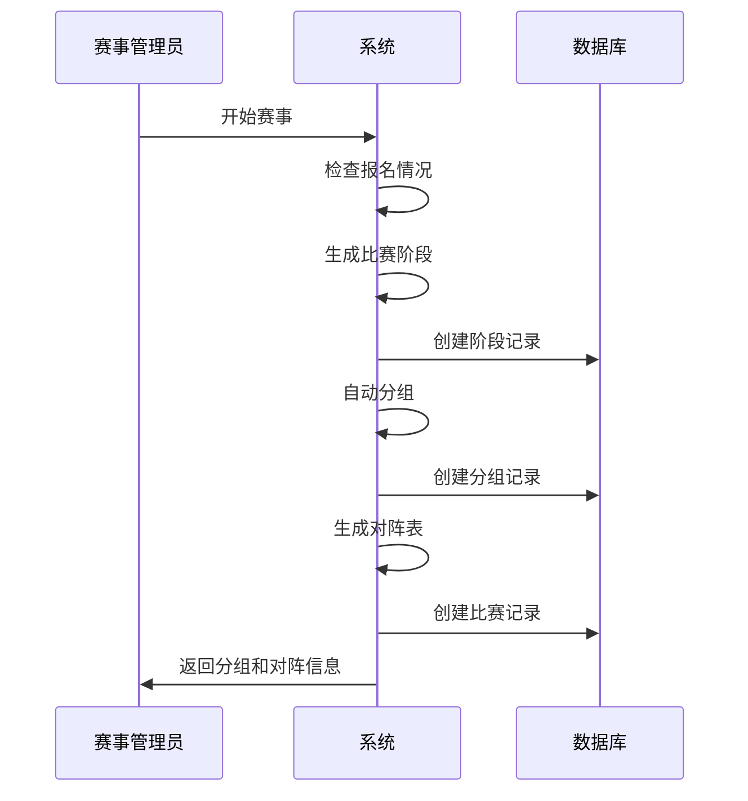
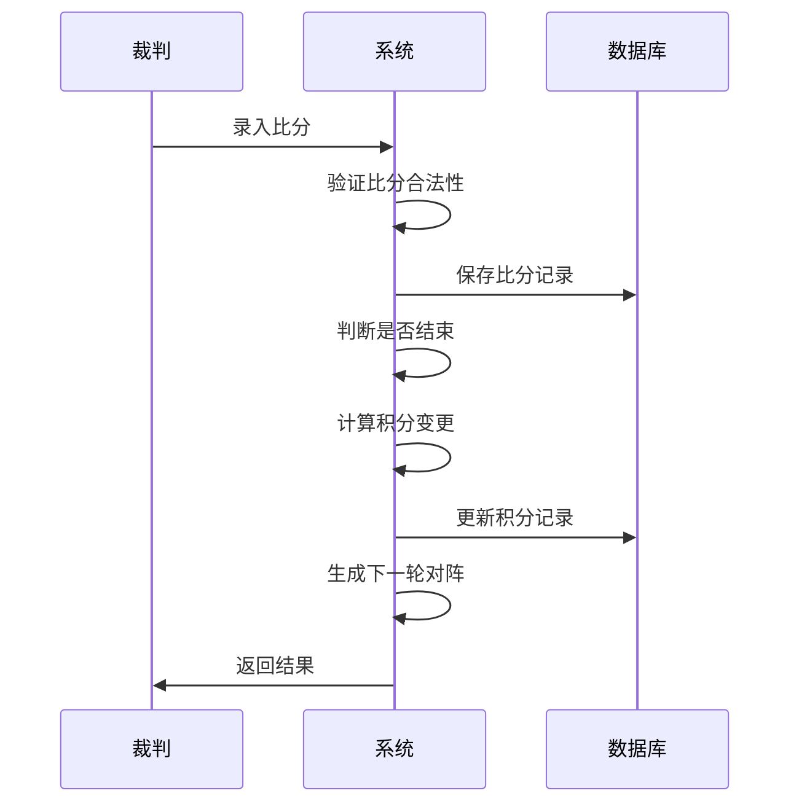

# 赛事记录实现设计说明

## 1. 表设计思路

### 1.1 核心表关系

赛事记录功能涉及以下核心表：

- tournament_stage（比赛阶段表）：记录赛事的各个阶段，如小组赛、淘汰赛等
- tournament_group（比赛分组表）：记录每个阶段的分组情况
- match_record（比赛记录表）：记录具体的对阵信息
- match_detail（比赛详情表）：记录每场比赛的详细比分

表关系：
1. 一个赛事(tournament)包含多个阶段(tournament_stage)
2. 一个阶段可以包含多个分组(tournament_group)
3. 一个分组包含多场比赛(match_record)
4. 一场比赛包含多局比赛详情(match_detail)

### 1.2 字段设计说明

#### tournament_stage 表
- type：阶段类型，区分循环赛和淘汰赛
- status：阶段状态，控制阶段流转
- order_num：阶段顺序，控制阶段进行顺序

#### tournament_group 表
- stage_id：关联阶段，表明分组所属阶段
- name：分组名称，如A组、B组等

#### match_record 表
- stage_id, group_id：关联阶段和分组
- player1_id, player2_id：对阵双方
- status：比赛状态，控制比赛流程
- round：比赛轮次，用于淘汰赛轮次管理

#### match_detail 表
- game_number：局数，记录每一局的情况
- player1_score, player2_score：双方比分

## 2. 业务流程

### 2.1 赛事阶段流转

### 2.2 比赛记录流程

## 3. 关键功能实现

### 3.1 自动分组算法

1. 分组原则：
   - 根据参赛人数确定分组数量
   - 尽量保证每组人数均衡
   - 考虑选手积分均衡

2. 实现步骤：
   - 获取所有参赛选手列表
   - 按积分排序
   - 蛇形分组（S型分组法）确保积分均衡
   - 随机微调避免相似积分选手集中

### 3.2 对阵生成规则

1. 小组赛：
   - 采用循环赛制
   - 每个选手需要与组内其他选手各赛一场
   - 生成对阵时考虑场地和时间安排

2. 淘汰赛：
   - 根据小组赛成绩确定种子选手
   - 采用标准淘汰赛制
   - 对阵安排遵循种子选手分散原则

### 3.3 积分计算规则

1. 基础积分：
   - 胜者获得基础积分
   - 负者扣除基础积分

2. 积分调整：
   - 根据双方积分差值调整变更幅度
   - 积分差越大，高分选手获胜积分越少
   - 低分选手获胜可获得额外积分

3. 特殊规则：
   - 弃权比赛按特殊规则处理
   - 关键比赛（如决赛）可设置积分加成

## 4. 注意事项

1. 数据一致性：
   - 比赛状态变更需要添加事务控制
   - 积分变更需要保证原子性

2. 并发处理：
   - 多场比赛同时进行的并发控制
   - 积分变更的并发控制

3. 异常处理：
   - 比分录入异常的处理机制
   - 选手弃权的处理机制
   - 比赛中断的恢复机制