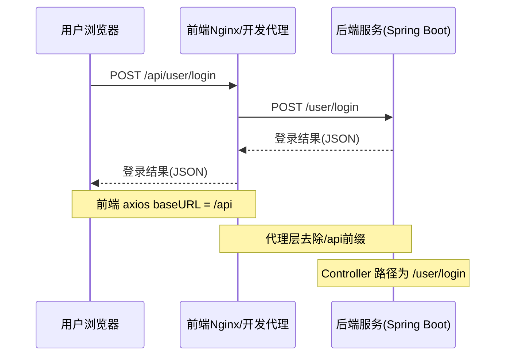

# mini-sports 项目前后端接口与代理适配总结

## 1. 前端 axios 配置

- `baseURL: '/api'`，所有前端请求自动带 `/api` 前缀。
- 业务代码只需写 `/user/login`，axios 会自动拼接为 `/api/user/login`。

## 2. 本地开发环境（vue.config.js）

```js
proxy: {
  '/api': {
    target: 'http://localhost:8088',
    changeOrigin: true,
    pathRewrite: {
      '^/api': '' // 代理时去掉 /api 前缀
    }
  }
}
```
- 所有 `/api/xxx` 请求代理到 `http://localhost:8088/xxx`。
- 后端 Controller 路径无需 `/api` 前缀，保持简洁。

## 3. 生产环境（Nginx 配置）

```nginx
location /api/ {
    proxy_pass http://backend:8088/;
    ...
}
```
- 生产环境下，Nginx 负责代理 `/api/xxx` 到后端 `http://backend:8088/xxx`。
- 用户访问 `/api/xxx`，Nginx 代理到后端，无需前端代码变更。

## 4. 后端接口实现

- Spring Boot Controller 路径如 `/user/login`，不带 `/api` 前缀。
- 这样后端接口路径简洁，易维护。

## 5. 路径流转示意

- 前端请求：`/api/user/login`
- 开发代理：`/api/user/login` → `/user/login`
- 生产代理：`/api/user/login` → `/user/login`
- 后端实际接口：`/user/login`

## 6. 设计优势

- 前端请求路径统一，开发/生产环境切换无感。
- 代理层负责路径适配，后端接口保持简洁。
- 便于后续扩展 context-path 或多服务代理。

## 7. 常见问题与排查

- 若 404，优先检查代理配置、后端端口、接口路径是否一致。
- 若 405，检查请求方法与后端接口是否匹配。
- 若数据库 migration 报错，需保证 SQL 幂等。

---

## 8. 前后端接口请求时序图



本总结梳理了 mini-sports 项目前后端接口路径、代理、Nginx、开发与生产环境适配的最佳实践与原理，便于后续维护和团队协作。 